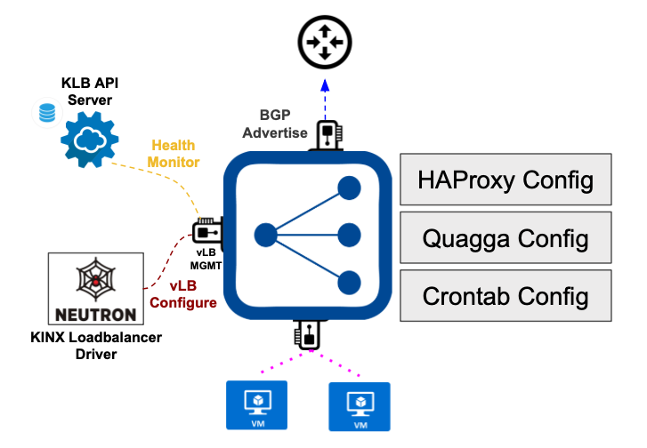

KINX-loadbalancer-agent
========================

What is KINX loadbalancer agent?
---------------------------------

HAproxy agent is agent which help to make HAProxy configuration and support neighboring with L3 switch to support N+1 Loadbalancer using ECMP.
HAproxy agent serve REST API request using Flask & Gunicorn.

KINX Loadbalancer Agent Architecture
-------------------------------------

REST API Example
----------------

* Loadbalancer POST API: ``/api/haproxy/loadbalancers``
   **Example request**:

   .. code-block:: javascript

      {
          "id": "lb_id",
          "name": "lb_name",
          "description": "lb_description",
          "enabled": "lb_admin_state_up",
          "project_id": "lb.tenant_id"
      }

   **Example HAProxy config result**:
   ::

    global
        daemon
        user nobody
        group nogroup
        log /dev/log local0 err
        log /dev/log local1 err
        stats socket /run/haproxy/admin.sock mode 660 level admin

    defaults
        log global
        retries 3
        option redispatch
        timeout connect 5000
        timeout client 50000
        timeout server 50000

* Listener POST API: ``/api/haproxy/listeners``
   **Example request**:

   .. code-block:: javascript

      {
          "name": "listener.name",
          "description": "listener.description",
          "enabled": "listener.admin_state_up",
          "protocol": "listener.protocol",
          "protocol_port": "listener.protocol_port",
          "protocol_mode": "listener.protocol",
          "connection_limit": "listener.connection_limit",
          "tls_certificate_id": "listener.default_tls_container_id",
          "default_pool_id": "listener.default_pool_id",
          "sni_containers": "sni_container_ids",
          "vip_address": "listener.loadbalancer.vip_address",
          "id": "listener.id"
      }

   **Example HAProxy config result**:
   ::

    ...
    frontend 5d4e74e8-ccaa-4e2c-a2d0-bc82f60a3c61
    option tcplog
    maxconn 12000
    bind 1.201.0.47:80
    mode http
    default_backend backend-5d4e74e8-ccaa-4e2c-a2d0-bc82f60a3c61 -> (Pool name)

* Pool POST API: ``/api/haproxy/pools``
   **Example request**:

   .. code-block:: javascript

      {
          "name": "pool.name",
          "description": "pool.description",
          "enabled": "pool.admin_state_up",
          "protocol": "pool.protocol",
          "protocol_mode": "pool.protocol",
          "stick_size": "STICKY_SIZE",
          "stick_expire": "STICKY_EXPIRE",
          "lb_algorithm": "pool.lb_algorithm",
          "listener_id": "pool.listeners.id",
          "loadbalancer_id": "pool.loadbalancer.id",
          "id": "pool.id"
      }

   **Example HAProxy config result**:
   ::

    ...
    backend backend-5d4e74e8-ccaa-4e2c-a2d0-bc82f60a3c61
    mode http
    balance roundrobin
    stick-table type ip size 200k expire 1d peers kinx_loadbalancer_peers
    stick on src
    option forwardfor

* Member POST API: ``/api/haproxy/pools/<listener_id>/members``
   **Example request**:

   .. code-block:: javascript

      {
          "id": "member.id",
          "enabled": "member.admin_state_up",
          "address": "member.address",
          "protocol_port": "member.protocol_port",
          "weight": "member.weight",
          "type": "member.pool.session_persistence.type",
          "cookie_name": "member.pool.session_persistence.cookie_name",
          "healthmonitor": {
              "type": "hm.type",
              ....
          }
      }

   **Example HAProxy config result**:
   ::

    backend backend-5d4e74e8-ccaa-4e2c-a2d0-bc82f60a3c61
    ...
    option forwardfor
    server a0c8e3ff-5791-42dd-ac9f-f3bd0450c654 192.168.55.36:80 weight 1

* HealthMonitor POST API: ``/api/haproxy/healthmonitors``
   **Example request**:

   .. code-block:: javascript

      {
          "name": "pool.name",
          "description": "pool.description",
          "enabled": "pool.admin_state_up",
          "protocol": "pool.protocol",
          "protocol_mode": "pool.protocol",
          "stick_size": "STICKY_SIZE",
          "stick_expire": "STICKY_EXPIRE",
          "lb_algorithm": "pool.lb_algorithm",
          "listener_id": "pool.listeners.id",
          "loadbalancer_id": "pool.loadbalancer.id",
          "healthmonitor": {
              "type": "hm.type",
              ....
          }
      }

   **Example HAProxy config result**:
   ::

    backend backend-5d4e74e8-ccaa-4e2c-a2d0-bc82f60a3c61
        mode http
        balance roundrobin
        stick-table type ip size 200k expire 1d peers kinx_loadbalancer_peers
        stick on src
        timeout check 10
        option httpchk GET /
        http-check expect rstatus 200
        option forwardfor
        server a0c8e3ff-5791-42dd-ac9f-f3bd0450c654 192.168.55.36:80 weight 1 check inter 3s fall 2 rise 2

* Peer POST API: ``/api/haproxy/peers``
   **Example request**:

   .. code-block:: javascript

      {
          "hostname": "hostname",
          "address": "address"
      }

   **Example HAProxy config result**:
   ::

    peers kinx_loadbalancer_peers
        peer lbv-37f0c3aa-a754-4f2c-9712-e35422002cea 10.40.252.235:1024
        peer lbv-6f07625e-4731-4532-a429-dc7adf1e79d3 10.40.252.234:1024

* Quaaga POST API: ``/api/quagga``
   **Example request**:

   .. code-block:: javascript

      {
          "hostname": "hostname",
          "inter_as_number": "inter_as_number",
          "vm_addr": "l3_addr",
          "primary_gateway_addr": "primary_l3_gateway_addr",
          "secondary_gateway_addr": "secondary_l3_gateway_addr",
          "router_as_number": "l3_router_as_number",
          "vip_addr": "vip_addr"
      }

   **Example Quaaga Request result**:
   ::

    root@lbv-37:/home/ubuntu# ifconfig
    ....
    lo:0      Link encap:Local Loopback
              inet addr:1.201.0.47  Mask:255.255.255.255
              UP LOOPBACK RUNNING  MTU:65536  Metric:1

    root@lbv-37:/home/ubuntu# vim /etc/quagga/bgpd.conf
    hostname lbv-37f0c3aa-a754-4f2c-9712-e35422002cea
    password pass
    !
    router bgp 50235
     bgp router-id 10.40.252.235
     redistribute static route-map bgp-access
     neighbor 10.40.252.2 remote-as 60201
     neighbor 10.40.252.3 remote-as 60201
     network 1.201.0.47/32
    !
    route-map bgp-access permit 10
     match ip address prefix-list pl-route
    !
    ip prefix-list pl-route seq 10 permit 0.0.0.0/0 ge 31
    !
    log file /var/log/quagga/bgpd.log
    !
    line vty

* Crontab POST API: ``/api/crontab``
   **Example request**:

   .. code-block:: javascript

      {
          "agent_addr": "agent_addr",
          "agent_port": "agent_port",
          "tenant_id": "lb.tenant_id",
          "vm_id": "vm_id"
      }

   **Example Crontab config result**:
   ::

    root@lbv-37:/home/ubuntu# crontab -e
    * * * * * /usr/local/bin/check_vlb

Installation
------------

.. note::  You should use Ubuntu 16.04 image
   Because of auto network interface setting

#. Install Package::

    $ apt-get update -y
    $ apt-get install python-minimal -y
    $ apt-get install python2.7-dev git -y
    $ add-apt-repository ppa:vbernat/haproxy-1.6 #version 1.6.11
    $ apt-get update -y
    $ apt-get install haproxy -y
    $ apt-get install python-setuptools build-essential libssl-dev -y
    $ easy_install pip
    $ pip install flask==1.0.2
    $ pip install Flask-HTTPAuth==3.2.4
    $ pip install psutil==5.0.1
    $ pip install parse==1.8.4
    $ pip install python-crontab==2.3.4
    $ pip install gunicorn==19.9.0
    $ pip install webob==1.8.2
    $ pip install netaddr==0.7.19
    $ apt-get install supervisor -y
    $ apt-get install quagga
    $ apt install socat

#. Make ``/opt/kinx_loadbalancer_agent`` directory for File Storage(Member, Peer)::

    $ mkdir /opt/kinx_loadbalancer_agent

#. Make ``/etc/haproxy/conf.d`` directory for piece of haproxy file::

    $ mkdir /etc/haproxy/conf.d

#. Download kinx loadbalancer github & copy whole file to local dist-packages::

    $ git clone https://github.com/kinxnet/kinx-loadbalancer.git
    $ cp kinx-loadbalancer/bin/kinx_loadbalancer_agent /usr/local/bin/
    $ sudo chmod +x /usr/local/bin/kinx_loadbalancer_agent
    $ cp -rf kinx-loadbalancer/kinx_loadbalancer_agent /usr/local/lib/python2.7/dist-packages/

#. Supervisor Setting (Retrieve from sample file in ``samples/kinx_haproxy_agent.conf``)::

    $ cp kinx-loadbalancer/etc/kinx_loadbalancer_agent.conf /etc/supervisor/conf.d/
    $ vim kinx_haproxy_agent.conf

    [program:kinx_loadbalancer_agent]  ;
    command=/usr/local/bin/kinx_loadbalancer_agent ;
    autostart=true ;
    autorestart=true ;
    user=root ;
    redirect_stderr=true  ;
    stdout_logfile=/var/log/supervisor/haproxy_agent.log  ;

#. Supervisor reload::

    $ supervisorctl reload

#. Supervisor status check::

    $ supervisorctl status

#. Change logrotate settings::

    # /etc/logrotate.d/haproxy (ex: rotate 52 -> rotate 7)
    /var/log/haproxy.log {
        daily
        rotate 7
        missingok
        notifempty
        compress
        delaycompress
        postrotate
            invoke-rc.d rsyslog rotate >/dev/null 2>&1 || true
        endscript
    }

#. Quagga configuration::

    $ vim /etc/quagga/debian.conf
    vtysh_enable=yes
    zebra_options="  --daemon -A 0.0.0.0"
    bgpd_options="   --daemon -A 0.0.0.0"

    $ vim /etc/quagga/daemons
    zebra=yes
    bgpd=yes

    $ service quagga restart

#. Create Glace Image from VM::

    $ nova --debug image-create --show {vm-uuid} {image-name} # raw file
    $ glance image-download --file {file-name] --progress {image-id}
    $ qemu-img convert -f raw -O qcow2 {raw-image} {qcow2-image}
    $ glance image-create --disk-format qcow2 --container-format bare --visibility public --progress --name {image-name} --file {qcow2-image}

How to debug
------------

* Can connect with os_dev.pem in kinx-loadbalancer Gibhub Repository(https://github.com/kinxnet/kinx-loadbalancer/blob/master/key/os_dev.pem) via vLB MTMG Network::

    $ ssh -i os_dev.pem ubuntu@10.30.252.255

* Trace log file ``/var/log/kinx-loadbalancer-agent.log`` in vLB VMs

 

