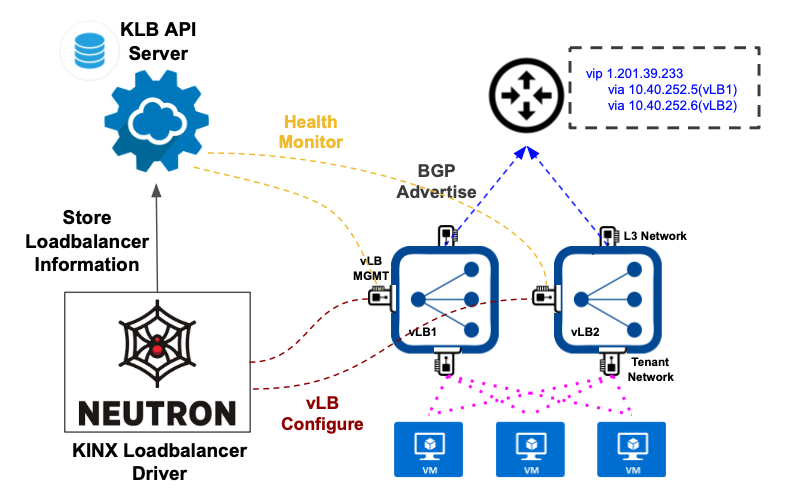

KINX-loadbalancer-driver
========================

What is KINX loadbalancer driver?
---------------------------------

KINX loadbalancer driver is Openstack neutron lbaasv2 driver which create VM-based reverse proxy & loadbalancer.

KINX Loadbalancer Driver Architecture
-------------------------------------

Work Flow
---------

* Create **Loadbalancer**

  #. Create Security Group & Rule
  #. Create Server Group for seperation of VM server to different host
  #. Create Two Loadbalancer VM (Active-Active)
  #. Request storing virtual-loadbalancer information to vlb-api server (VLB ID, etc...)
  #. Wait until VM is active status
  #. Create Ceilometer Alarm (PPS Threshold)
  #. Request storing created VMs infortaming to vlb-api server (VM ID, Alarm ID, etc...)
  #. Update Port Address Pair with VIP
  #. Request configuration of loadbalancer to created VMs (haproxy.cfg)
  #. Request configuration of peer between created VMs (haproxy.cfg)
  #. Request configuration of quagga for ECMP loadbalancing
  #. Request configuration of crontab that periodically send VMs Health Information

* Create **Listener**

  #. Update Security Group Rule that user requests such as port
  #. Recieve loadbalancer VMs information(LB-MGMT IP) from vlb-api databases
  #. Request configuration of listener to loadbalancer VMs

* Create **Pool**

  #. Recieve loadbalancer VMs information(LB-MGMT IP) from vlb-api databases
  #. Request configuration of pool to loadbalancer VMs

* Create **Member**

  #. Recieve loadbalancer VMs information(LB-MGMT IP) from vlb-api databases
  #. Request configuration of member to loadbalancer VMs

* Create **Healthmonitor**

  #. Recieve loadbalancer VMs information(LB-MGMT IP) from vlb-api databases
  #. Request configuration of healthmonitor to loadbalancer VMs

Installation
------------

#. Clone kinx-loadbalancer github repository::

    $ git clone https://github.com/kinxnet/kinx-loadbalancer.git

#. Copy kinx-loadbalancer driver to Openstack neutron_lbaas driver::

    $ cp -rf kinx-loadbalancer/kinx_loadbalancer_driver /usr/lib/python2.7/dist-packages/neutron_lbaas/drivers/kinx

#. Create availibility zone for kinx-loadbalancer

#. Add Kinx-loadbalancer configuration to ``/etc/neutron/neutron.conf``::

    [DEFAULT]
    dhcp_agents_per_network=3

    [service_providers]
    service_provider=LOADBALANCERV2:Kinx:neutron_lbaas.drivers.kinx_driver.driver.KinxDriver:default

    [kinx_haproxy]
    image_id=7de0af35-14d3-4771-8af5-48cbce75ea1d # Image ID
    base_flavor_id=880a8c79-6967-4c27-8ef7-1fe092bbeeda # Flavor ID
    auth_url=http://192.168.0.2:35357/v2.0/
    endpoint_url=http://192.168.0.2:9696/
    kinx_office_ip=211.196.205.71/32
    agent_user=kinx_haproxy_user
    agent_password=ee71f1d37d8c4f96ac4fbb5ebecd65a9
    agent_port=62000
    default_maxconn=12000
    loadbalancer_instance_volume_size=50
    availibility_zone=lbaas-az
    lb_api_agent_addr=192.168.0.4
    lb_api_agent_port=6543
    lb_mgmt_subnet=10.30.252.0/22
    lb_mgmt_net_id=0589ee28-9e73-42ef-ba58-41e5b32a85ba
    lb_mgmt_net_name=lb-mgmt-net
    lb_l3_subnet=10.40.252.0/22
    lb_l3_net_id=bb0d0a66-e039-4b24-a4ba-2b27f1ad1169
    lb_l3_net_name=lb-l3-net
    base_as_number=10000
    primary_l3_gateway_addr=10.40.252.2
    secondary_l3_gateway_addr=10.40.252.3
    l3_router_as_number=60201
    ceilometer_period=60
    ceilometer_evaluation_periods=3
    ceilometer_pps_threshold=20000

#. Restart neutron server::

    $ service neutron-server restart
